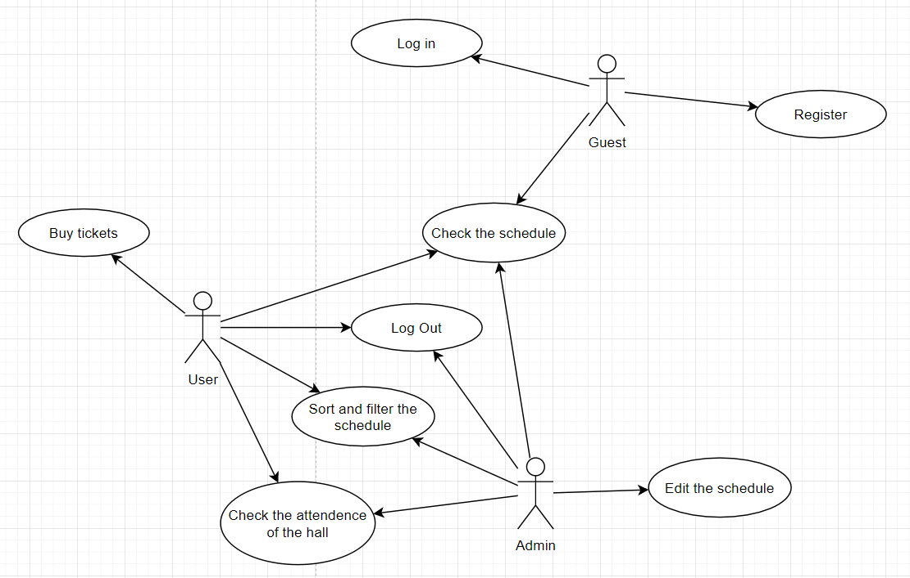
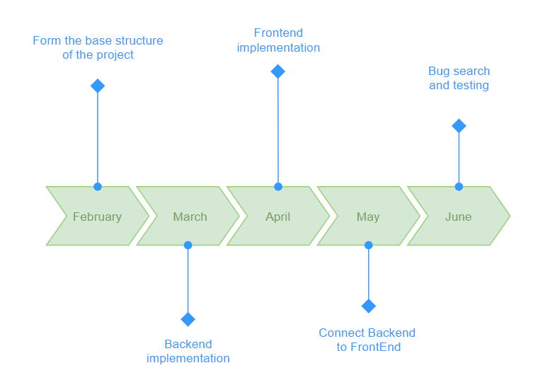

# Cinema

### Description

A Spring Boot project which represents an internet showcase of a cinema with a single hall. There is a week schedule of film sessions in the system.

Unauthorized user can see the schedule, free places for a session and register.

Authorized user can sort the schedule by film title, by free places quantity and by session start time. He also can filter the schedule by movies available for viewing and to purchase a ticket for a session.

Administrator can add sessions to the schedule, delete them and to check the attendance of the hall.

---

### Team

- Full-stack developer: [Sokolov Volodymyr](https://github.com/SakalOFF)

---
### Details
Performing Presentation layer:
- Use HTML5 and CSS developing web pages.
- Use Thymeleaf as a template engine for HTML pages.
- Develop dynamic content of web pages using javascript.
- Implement CSRF protection.
- Perform internationalization.

Performing Application layer:
- Develop authorization and access rights via Spring Security.
- Implement global exception handling.
- Perform bcrypt password encoding.
- Implement server-side data validation.
- Implement unit testing using JUnit and Mockito.

Performing Data access layer:
- Develop database structure.
- Use Hibernate for automatic generation and updating of tables, building queries, performing transactions, and processing the received data.
- Perform one-to-many and many-to-many table connections.
- Implement logging using Log4j.

---

### Database

MySQL

### Tools

MySQL Worckbench, IntelliJ IDEA Ultimate, Git, GitHub, Maven.

### Technologies

Java SE 8, Spring Boot, Thymeleaf, Hibernate, HTTP, HTML, CSS, Javascript, SQL, Log4j, Lombock, Mockito, JUnit.

### Why these?

#### Spring Boot:
- It is very easy to develop Spring Based applications with Java or Groovy.
- It reduces lots of development time and increases productivity.
- It avoids writing lots of boilerplate Code, Annotations and XML Configuration.
- It is very easy to integrate Spring Boot Application with its Spring Ecosystem like Spring JDBC, Spring ORM, Spring Data, Spring Security etc.
- It follows “Opinionated Defaults Configuration” Approach to reduce Developer effort
- It provides Embedded HTTP servers like Tomcat, Jetty etc. to develop and test our web applications very easily.
- It provides CLI (Command Line Interface) tool to develop and test Spring Boot(Java or Groovy) Applications from command prompt very easily and quickly.
- It provides lots of plugins to develop and test Spring Boot Applications very easily using Build Tools like Maven and Gradle
- It provides lots of plugins to work with embedded and in-memory Databases very easily.

#### Hibernate:
- It is open source under the LGPL license and lightweight.
- The performance of hibernate framework is fast because cache is internally used in hibernate framework. There are two types of cache in hibernate framework first level cache and second level cache. First level cache is enabled by default.
- HQL (Hibernate Query Language) is the object-oriented version of SQL. It generates the database independent queries. So you don't need to write database specific queries. Before Hibernate, if database is changed for the project, we need to change the SQL query as well that leads to the maintenance problem.
- It provides the facility to create the tables of the database automatically. So there is no need to create tables in the database manually.
- Fetching data from multiple tables is easy in hibernate framework.
- It supports Query cache and provide statistics about query and database status.

#### Mockito:
- No Handwriting − No need to write mock objects on your own.
- Refactoring Safe − Renaming interface method names or reordering parameters will not break the test code as Mocks are created at runtime.
- Return value support − Supports return values.
- Exception support − Supports exceptions.
- Order check support − Supports check on order of method calls.
- Annotation support − Supports creating mocks using annotation.

#### MySQL:
- Data Security
- On-Demand Scalability
- High Performance
- Round-the-Clock Uptime
- Comprehensive Transactional Support
- Complete Workflow Control

---

### Use Case Diagram

### TimeLine

### Database schema

